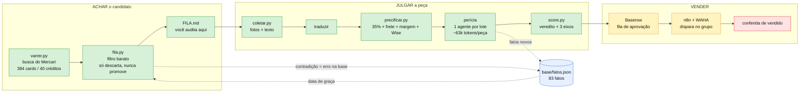
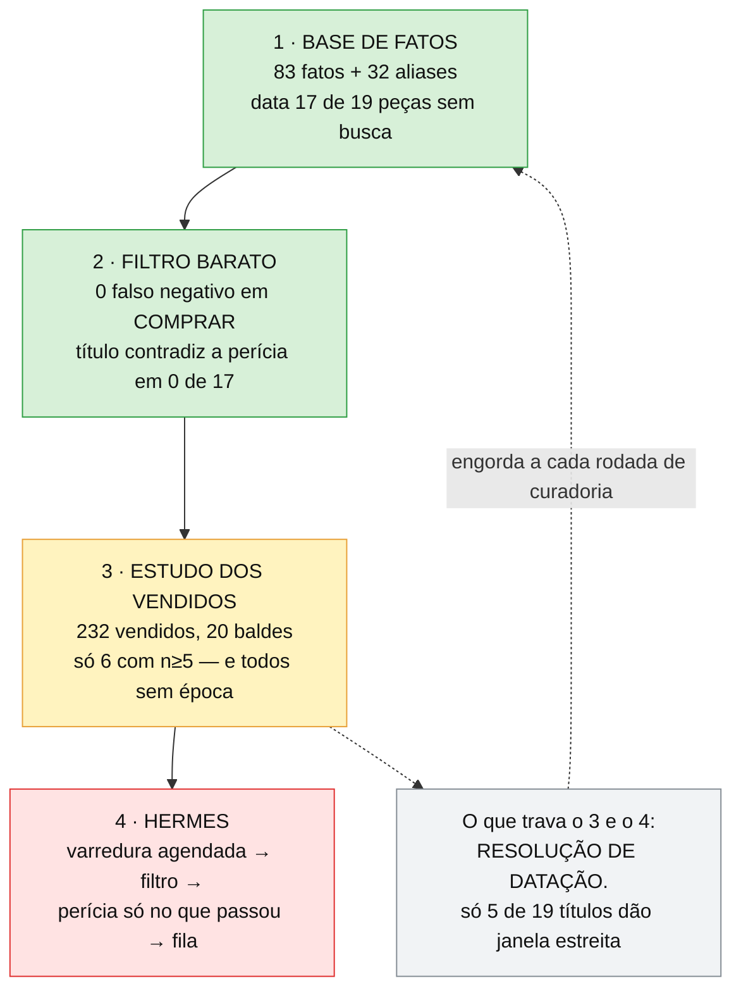
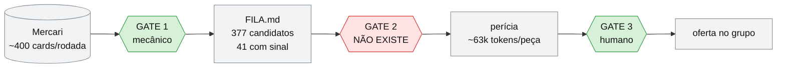

# 🏁 Hermes — a arquitetura, em três desenhos

> Nota de **clareza**, não de estado. O estado vive em [[motor-ofertas-nsc]]; os números crus
> vivem em `curadoria/PROVA.md`. Aqui é só o mapa: **onde estamos, para onde vai, e o que
> decide o quê.**

---

## 1. A esteira inteira — o que existe e o que não

🟩 **pronto e rodado** · 🟨 **existe mas parado desde 05/08** · 🟥 **nunca existiu**

O laço pontilhado é o que a sessão de 19/08 descobriu: **a base não só alimenta o filtro, ela é
auditada por ele.** Uma varredura de 40 créditos achou dois erros numa base que custou ~1,2
milhão de tokens de perícia.

---

## 2. Os 4 degraus até o Hermes

**O degrau 3 roda, mas não fala.** O único balde com amostra é *"jaqueta Ferrari, qualquer
época"* — ¥800 a ¥170.000. Isso não julga peça nenhuma, e o script devolve `sem base` onde
importaria, que é o comportamento certo.

**A saída não é mais dado bruto, é mais base.** Cada rodada de curadoria engorda os fatos de
graça, e é isso que estreita a datação — que por sua vez destrava o comparável e o corte.

---

## 3. Os 3 gates — e o único que falta

| gate | onde mora | quem decide | estado |
|---|---|---|---|
| **1 · varredura → fila** | `fila.py` | mecânico: dedup + flags. **Só descarta, nunca promove** | ✅ existe |
| **2 · fila → perícia** | *nenhum lugar* | **você**, por um teto de peças por rodada | ⛔ **é o buraco** |
| **3 · perícia → oferta** | `valida.py` + veredito + aprovação no Baserow | você | ✅ existe |

**Por que o gate 2 importa:** hoje nada limita quantas peças sobem para a perícia cara. Sem
ele, um funil que traz 400 candidatos não economiza — ele multiplica trabalho caro. O gate 1
quase não corta (7 de 384, e todos por dedup), e depois da decisão de 19/08 sabe-se que **não
vai cortar por preço**. Então o freio tem de ser humano e explícito.

> [!ABERTO]+ teto-de-pericia-por-rodada · 2026-08-19
> **Quantas peças por rodada podem subir da fila para a perícia cara?** É o gate 2, e o número
> é seu. Referência medida: a Etapa 2 periciou **19 peças em 21 minutos** com 7 peritos em
> paralelo, a ~63k tokens cada. A fila de hoje tem 377 candidatos, dos quais **41 carregam
> algum sinal** — e é desses 41 que a escolha sairia.
> destrava: o Hermes poder rodar sozinho. Sem teto, varredura agendada vira multiplicador de
> custo em vez de funil.

---

## A regra que atravessa os três

**O agente instrui, você decide.** Ela não é promessa de prompt, é estrutura:

- o filtro **só descarta** — não ranqueia por desejabilidade, porque ranquear seria escolher
- **todo descarte é auditável**: motivo + o trecho do título que o disparou, em `FILA.md`
- **nenhuma nota agregada** em lugar nenhum, com gate mecânico (`valida-varredura.py`)
  recusando `nota`, `score`, `rating`, `ranking`, `preco_de_mercado`
- **entidade tirada de título é hipótese**, sempre marcada — título de Mercari é SEO do
  vendedor, e foi assim que uma peça Honda vendeu "Senna" sem ter nada dele
- **as buscas são fronteira humana** (`buscas.json`): o agente nunca inventa uma consulta,
  porque escolher o universo é escolher produto um passo antes

---

## Onde clicar

| quero… | abrir |
|---|---|
| os números crus, com o que deu errado | `curadoria/PROVA.md` |
| auditar os candidatos e os descartes | `curadoria/varredura/FILA.md` |
| a régua do que é verificável | `curadoria/METODO.md` |
| o estado da frente e o próximo passo | [[motor-ofertas-nsc]] |
| a conta do preço | [[logistica-mercari]] |
