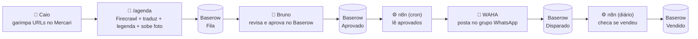

# Motor de Ofertas — "loja-in-a-box"

> Esteira que transforma uma loja de curadoria (Mercari → WhatsApp) numa operação quase sem trabalho manual, montada como **kit de skills de Claude Code + cérebro adaptável**. Sem backend robusto. 1ª instância: **Nippon Speed Co.** (memorabilia F1 vintage do Japão, parceria Caio).

## A ideia em uma frase
**Humano cura e aprova · Claude cria e traduz · n8n dispara sozinho.** Cada peça de valor está no lugar mais barato: setup pesado no Claude (uma vez por loja), operação recorrente no n8n (0 token).

▶️ **Como rodar / montar uma loja:** [`SETUP.md`](SETUP.md) · **Importar o disparo:** [`n8n/COMO-IMPORTAR.md`](n8n/COMO-IMPORTAR.md) · **O kit de skills:** `.claude/skills/` (embutido — o repo roda standalone, com ou sem o vault Obsidian).

---

## O fluxo (do garimpo à venda)



---

## Quem faz o quê — SETUP (1× por loja)

| Passo | Quem | O que acontece |
|---|---|---|
| Marca, logo, referência de design | 👤 **Humano** | Fornece identidade + ref Webflow + assets |
| Design system | 🤖 **Claude** `/marca` | Gera `design-system2.html` a partir da ref |
| Fotos do acervo | 👤 dá URLs → 🤖 `/acervo` | Humano **cura** as URLs; Claude baixa as fotos |
| Landing page + deploy | 🤖 **Claude** `/lp` | LP self-contained → Vercel, no ar |
| Contas & tokens (Firecrawl, Baserow, Vercel) + **subir o WAHA** | 👤 **Humano** | Cria contas; sobe a stack do WAHA; **conecta o WhatsApp (QR)** |
| Preencher `.env` | 👤 **Humano** | Cola os tokens — **só troca de valores** |
| Tabela/fila no Baserow | 🤖 **Claude** | Cria o schema via API |
| Importar workflow do n8n | 👤 **Humano** | Cola o JSON, preenche o node `Config`, ativa |

> A fronteira humana é **estreita e clara**: fornecer identidade, criar contas/tokens, escanear o QR, e **curar as URLs**. Todo o resto é Claude/automático.

## Quem faz o quê — OPERAÇÃO (recorrente)

| Passo | Quem | Custo |
|---|---|---|
| Garimpar a peça (achar a URL) | 👤 **Caio** | — (know-how humano) |
| Processar URL → fila (traduz, legenda, foto) | 🤖 **Claude** `/agenda` | ~baixo (1 tradução curta) |
| **Aprovar** (conferir tradução + foto) | 👤 **Bruno** (flip no Baserow) | 0 |
| Disparar no grupo | ⚙️ **n8n** (cron) | **0 token** |
| Checar vendidos + avisar | ⚙️ **n8n** (diário) | **0 token** |

---

## As 6 skills (o kit)
| Skill | Faz | Bloco |
|---|---|---|
| `/marca <ref>` | Design system da ref Webflow | Marca |
| `/acervo <urls>` | Baixa fotos curadas do Mercari | Marca |
| `/lp <produto>` | Landing page + deploy Vercel | Marca |
| `/agenda <url>` | URL → fila pronta pra aprovar | Ofertas |
| `/dispara-oferta` | Posta aprovados no grupo *(prod = n8n)* | Ofertas |
| `/confere-ofertas` | Marca vendidos + avisa *(prod = n8n)* | Ofertas |

## Stack
- **Firecrawl** — scrape do Mercari · **Baserow** — fila/DB (`DISPARADOR`, db 104/tabela 556) · **WAHA** — WhatsApp (auto-hospedado, `waha/stack-vps.yml`; substituiu a Z-API paga em 16/07) · **Vercel** — LP · **n8n** — cron de disparo (0 token).
- Segredos só no `.env` (fora do git). Ver `.env.example`.

## Arquitetura de custo (por que fecha como produto)
- **Claude** = setup (1×/loja, valor concentrado) + tradução/curadoria por peça (barato).
- **n8n** = disparo + checagem de vendidos = **~0 token** (HTTP puro).
- Logo: **operação por loja custa quase nada**; o token pesado é o setup, que é cobrável.

---

## Organização (rumo a produto)
```
.claude/skills/            # O KIT — reutilizável entre lojas
  marca/ acervo/ lp/ agenda/ dispara-oferta/ confere-ofertas/ post-feed/ post-stories/
projetos/motor-ofertas/    # A INSTÂNCIA (Nippon Speed Co.)
  CLAUDE.md                # cérebro da loja (adaptável)
  .env  /  .env.example    # tokens (humano preenche)
  marca/                   # tudo da marca, por tópico:
    acervo/                #   fotos das peças (do Mercari, via /acervo)
    campanha/              #   Meta Ads: brief + criativos
    conteudo/              #   Instagram: storytelling/ stories/ destaques/ + ideias-feed.md
    referencia/            #   design system + assets do Caio (fora do git)
  lp/                      # landing page
  n8n/nsc-dispara-ofertas.json   # workflow de disparo (importar no n8n)
  docs/                    # fontes da verdade: roteiro-lp · logistica-mercari · baserow-schema
  briefs/                  # pedidos do Bruno/Caio já aplicados (histórico)
```
**Pra abrir uma nova loja:** clona a instância, troca o cérebro (CLAUDE.md) + assets + `.env`, roda as skills de setup. O kit de skills não muda.

## Estado & próximos passos
✅ Esteira provada ponta a ponta (2026-07-02). Próximo: importar/ativar o n8n · preview de aprovação com imagem · `/confere-ofertas` no n8n · validar com o Caio antes de generalizar o kit.
🔐 Rotacionar a senha do Baserow (passou no chat durante o setup).
